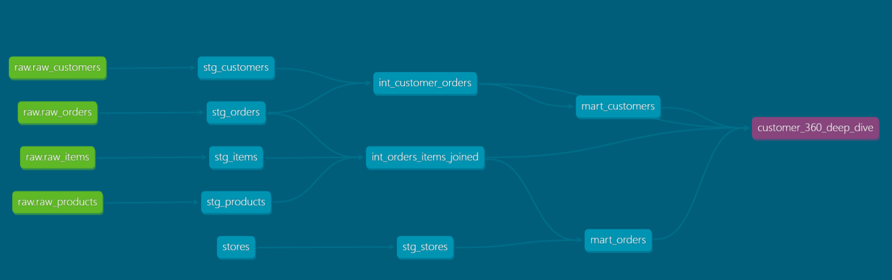
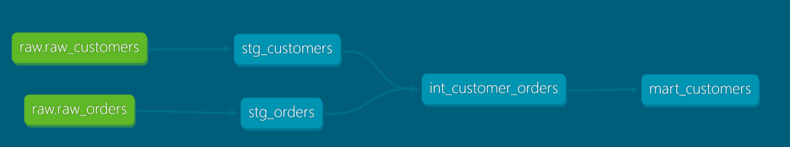
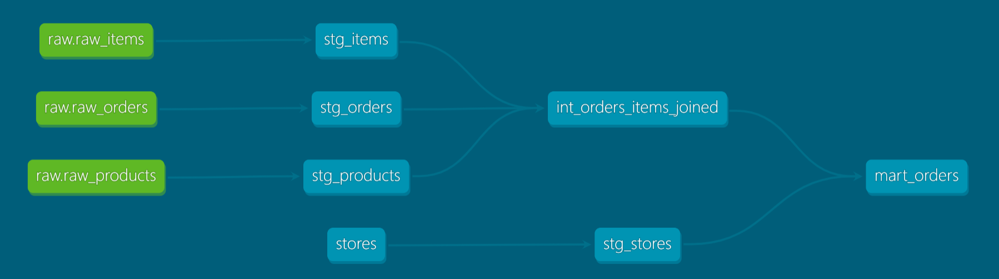

# DBT-Project-JaffelShop-Snowflake

### Initial Set up 
-- Pull Git repo
git clone https://github.com/himanshuSPaul/DBT-Project-JaffelShop-Snowflake.git


###### List All Branch
``` git branch -a```

###### Create New branch 
```git checkout -b feature/initial-set-up origin/feature/initial-set-up ```

###### Crate Virtual Env
``` python -m venv dbt-sf-venv ```

###### Activate Virtual Env
``` .\dbt-sf-venv\Scripts\Activate.ps1 ```

###### **Upgrade pip version**

``` python.exe -m pip install --upgrade pip ```

###### Install dbt package
``` pip install dbt-snowflake=1.10.6, snowflake-connector-python==4.1.1 ```


###### Initiate DBT package
```
(dbt-sf-venv) (dbt-sf-venv) D:\Learning\VSCode\DBT\DBT-JaffelShop-SF\DBT-Project-JaffelShop-Snowflake
> dbt init
05:13:17  Running with dbt=1.11.2
05:13:17  Setting up your profile.
The profile dbt_sf_handson already exists in C:\Users\Himanshu\.dbt\profiles.yml. Continue and overwrite it? [y/N]: y
Which database would you like to use?
[1] snowflake

(Don't see the one you want? https://docs.getdbt.com/docs/available-adapters)

Enter a number: 1
account (https://<this_value>.snowflakecomputing.com): xdyidpl-ui11981
user (dev username): himanshu
[1] password
[2] keypair
[3] sso
Desired authentication type option (enter a number): 1
password (dev password): 
role (dev role): ACCOUNTADMIN
warehouse (warehouse name): COMPUTE_WH
database (default database that dbt will build objects in): JAFFELSHOP_ECOM
schema (default schema that dbt will build objects in): PUBLIC
threads (1 or more) [1]: 4
05:15:10  Profile dbt_sf_handson written to C:\Users\Himanshu\.dbt\profiles.yml using target's profile_template.yml and your supplied values. Run 'dbt debug' to validate the connection.
(dbt-sf-venv) (dbt-sf-venv) D:\Learning\VSCode\DBT\DBT-JaffelShop-SF\DBT-Project-JaffelShop-Snowflake
>
```
##### DBT Prject Directory Structure

```
> tree /F
Folder PATH listing for volume New Volume
Volume serial number is E221-A9E7
D:.
> tree /F
Folder PATH listing for volume New Volume
Volume serial number is E221-A9E7
D:.
│   dbt_project.yml
│   
├───analysis
│       .gitkeep
│
├───data
│       .gitkeep
│
├───logs
│       .gitkeep
│       dbt.log
│
├───macros
│       .gitkeep
│
├───models
│       .gitkeep
│
├───seeds
│       .gitkeep
│
└───tests
        .gitkeep

```


## Folder Structure
```
Parent Folder        : D:\Learning\VSCode\DBT\DBT-JaffelShop-SF\DBT-Project-JaffelShop-Snowflake
Virtual Env          : D:\Learning\VSCode\DBT\DBT-JaffelShop-SF\DBT-Project-JaffelShop-Snowflake\dbt-sf-venv
Activate Virtual Env : D:\Learning\VSCode\DBT\DBT-JaffelShop-SF\DBT-Project-JaffelShop-Snowflake\dbt-sf-venv\Scripts\activate.ps1
DBT Project Path     : D:\Learning\VSCode\DBT\DBT-JaffelShop-SF\DBT-Project-JaffelShop-Snowflake\jaffelshop

```

## Data Lineage Graphs

### 1. Building Customers360 Deep Dive Dashboard  Lineage



### 1.a Building Mart Customers Lineage



### 1.b Mart Stores Lineage



### ** Step 1.b.1: Build stg_customers (Staging Customers)**
:
The CUSTOMERS raw table has names like "John Smith" but analytics needs them split into FIRST_NAME, LAST_NAME for better analysis. Also needs data quality checks.

**File to Create**: `models/stg/stg_customers.sql`

**Business Requirements**:
1. **Source**: Read from `customers` source (which points to `PUBLIC.CUSTOMERS` table)
2. **Transformations**:
   - Keep `CUSTOMER_ID` (primary key)
   - Rename `CUSTOMER_NAME` to  `CUSTOMER_NAME`
   - Split name into `FIRST_NAME`, `MIDDLE_NAME`, `LAST_NAME` 
   - Convert `CREATED_AT` to proper date format
   - Add `IS_VALID_CUSTOMER` flag (TRUE if `ID` and `name` both present)
3. **Quality Checks**:
   - Remove rows with NULL CUSTOMER_ID
   - ~~Only include customers created in 2024-2025~~
4. **Output Columns**:
   ```
   CUSTOMER_ID, CUSTOMER_NAME, FIRST_NAME, MIDDLE_NAME, LAST_NAME, 
   IS_VALID_CUSTOMER, CREATED_AT
   ```
